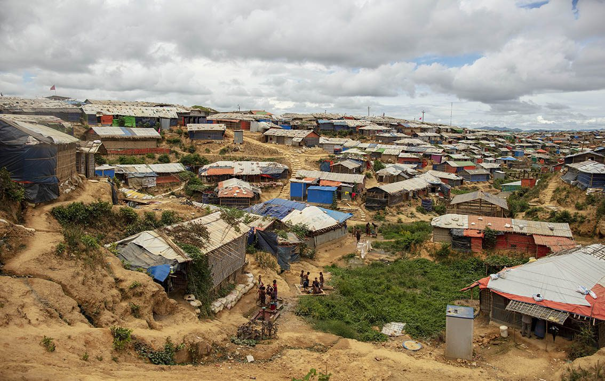
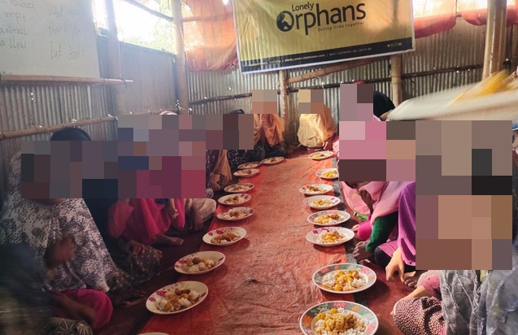
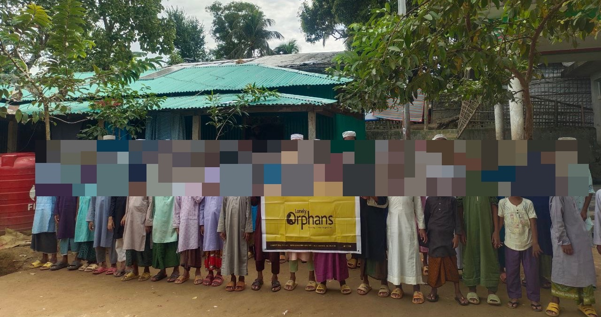

Lonely Orphans have been facilitating meals for Rohingya refugees on behalf of Little Giving users since April 2021.

The charity operates several shelters supporting refugees in a number of camps in Cox's Bazar, Bangladesh. This area is the world's largest refugee settlement, accommodating about one million refugees.

As of August 2023, 50,200 meals have been provided across five camps in the area (Balukhali, Jadimore, Kutupalong, Shamlapur, and Tangkali) through daily donations by Little Giving users.

You can contribute to this project by selecting Lonely Orphans as one of the charities you give to daily on Little Giving.

Lonely Orphans is a UK registered charity ([1171230](https://register-of-charities.charitycommission.gov.uk/charity-search/-/charity-details/5072018)) that provides care to refugee and vulnerable families in Bangladesh, Indonesia, Thailand and Turkey. The charity is based in east London. They can be contacted at [help@lonelyorphans.org](mailto:help@lonelyorphans.org).

Little Giving is a free service that helps you give a few pence in sadaqah every day. We hand-pick causes that we would donate to ourselves and then work with those charities to facilitate small daily donations from our users. See our [FAQs](https://www.littlegiving.org/support) for more details.

---

Note: Faces have been blurred to preserve the dignity of recipients.
