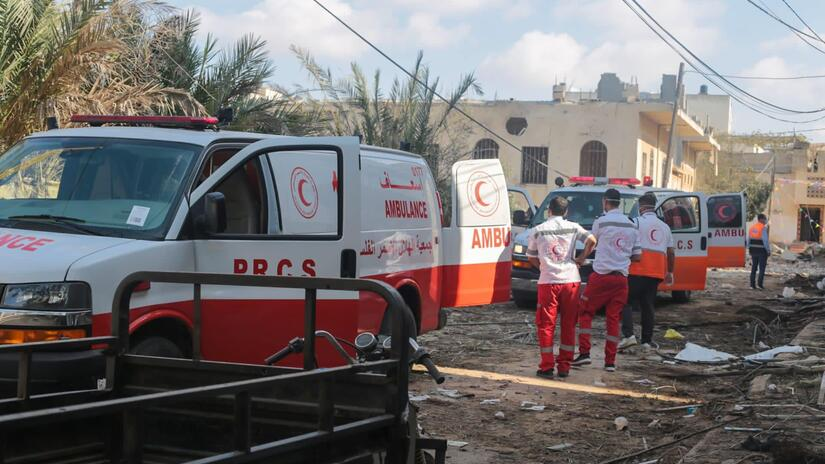
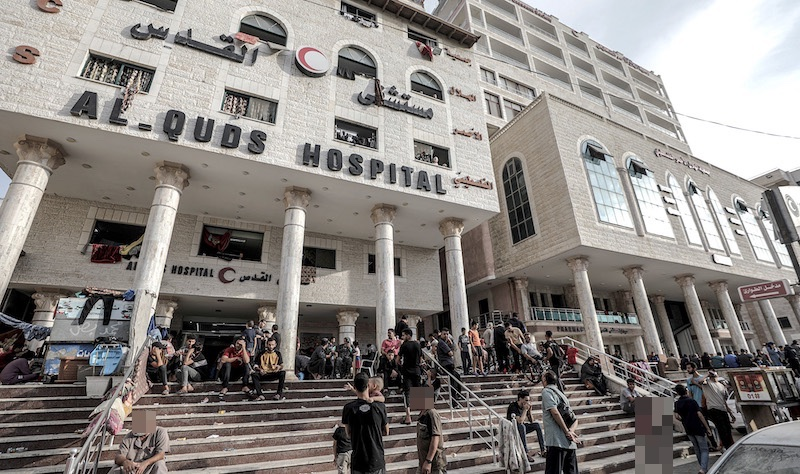
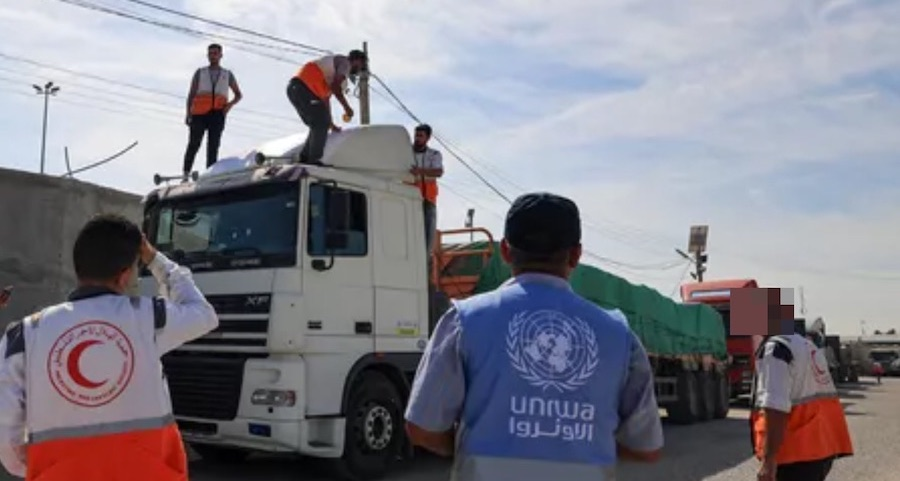

Users of Little Giving can now contribute a few pence every day to supply fuel for emergency and humanitarian programmes run by the Palestine Red Crescent in Gaza and the West Bank.

The Palestine Red Crescent is the main provider of emergency medical care in Palestine. They operate multiple medical facilities, including hospitals and clinics, and provide disaster relief and social welfare services.

Fuel plays a critical role in supporting almost all humanitarian functions, including power generation, water treatment, and the operation of machinery and vehicles.

The Messenger (sallallahu alayhi wasallam) when asked about the virtues of Batul Maqdis (Jerusalem), advised: *Send some oil to be lit therein* (Sharh Mushkilul Athar).

The Palestine Red Crescent has partnered with Little Giving to facilitate daily sadaqah contributions to provide fuel for their emergency and humanitarian programmes. They have committed to use 100% of funds for the agreed cause, without deductions for general administration or fundraising.

You can contribute to this project by selecting Palestine Red Crescent as one of the charities you give to daily on Little Giving.

Little Giving is a free service that helps you give a few pence in sadaqah every day. We hand-pick causes that we would donate to ourselves and then work with those charities to facilitate small daily donations from our users. See our [FAQs](https://www.littlegiving.org/support) for more details.

---

Note: Faces have been blurred to preserve the dignity of recipients.
