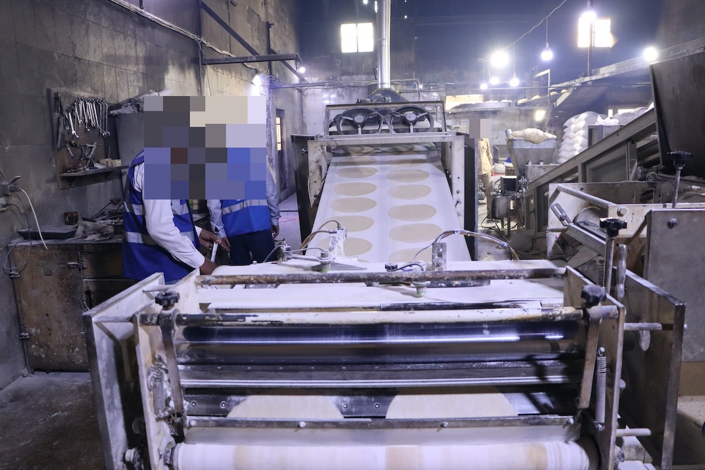
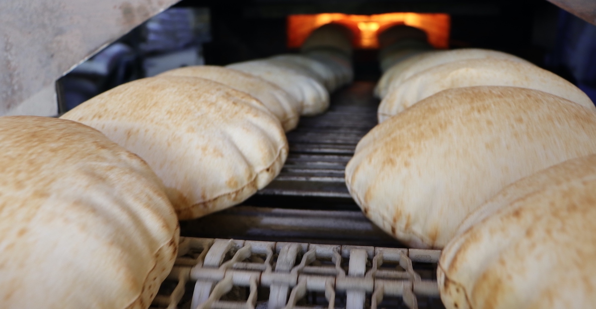
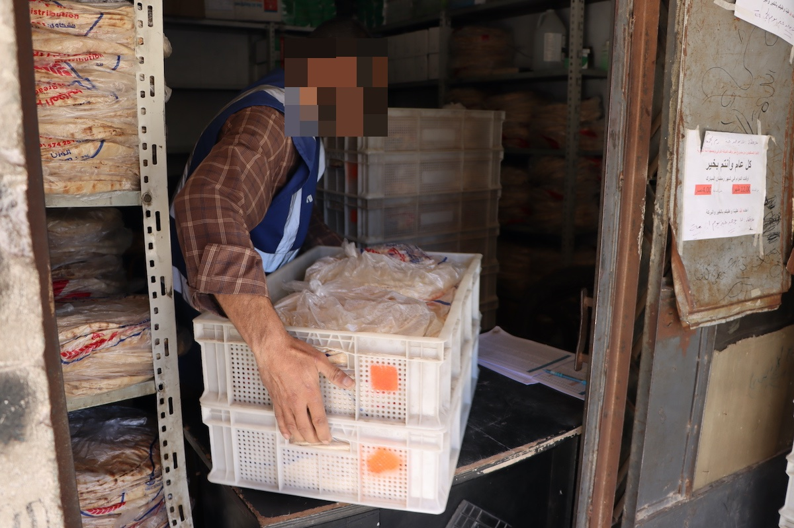
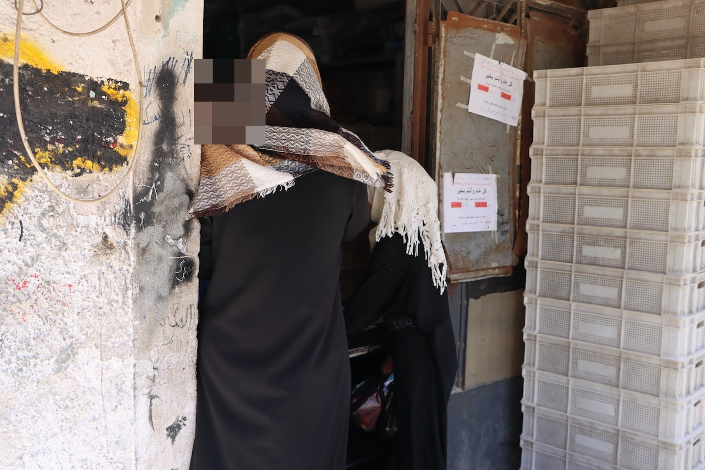
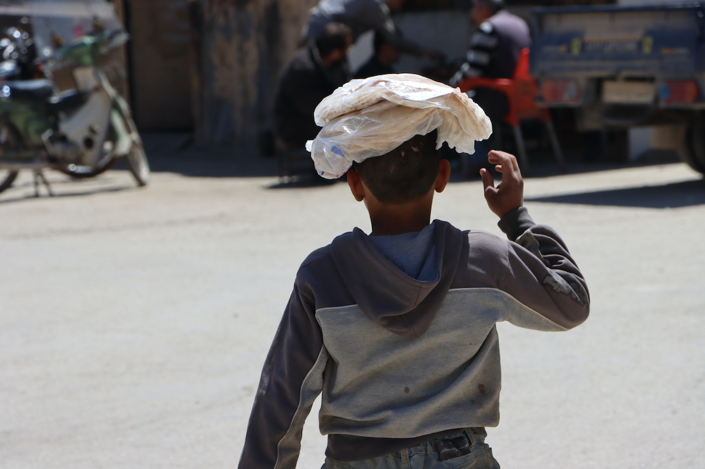

Over the past two years, Ummah Welfare Trust (UWT) have facilitated daily bread distribution in Syria for Little Giving users.

Since May 2021, the charity have run a bakery in Idlib, distributing packs of bread to 6,200 families (about 30,000 people), six days a week. Little Giving users made up about 4% of that figure (about 250 families).

Recipients were mainly refugees living in camps or temporary shelter in Idlib and the surrounding areas. The project ran until November 2022.

Currently daily donations to UWT go towards orphan and widow support programmes in Syria and Iraq. You can contribute to these programmes by selecting Ummah Welfare Trust as one of the charities you give to daily on Little Giving.

Ummah Welfare Trust is a UK registered charity ([1000851](https://register-of-charities.charitycommission.gov.uk/charity-search/-/charity-details/1000851)) that provides humanitarian relief to people affected by disasters and poverty, in over 20 countries. The trust's head office is in Bolton. The charity's Middle East team can be contacted at [middleeast@uwt.org](mailto:middleeast@uwt.org).

Little Giving is a free service that helps you give a few pence in sadaqah every day. We hand-pick causes that we would donate to ourselves and then work with those charities to facilitate small daily donations from our users. See our [FAQs](https://www.littlegiving.org/support) for more details.

---

Note: Faces have been blurred to preserve the dignity of recipients.
